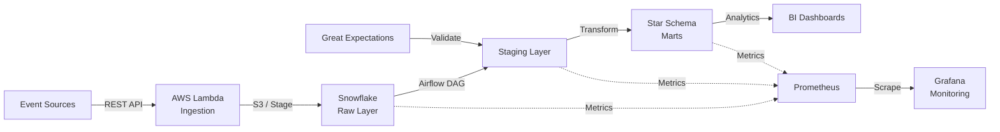
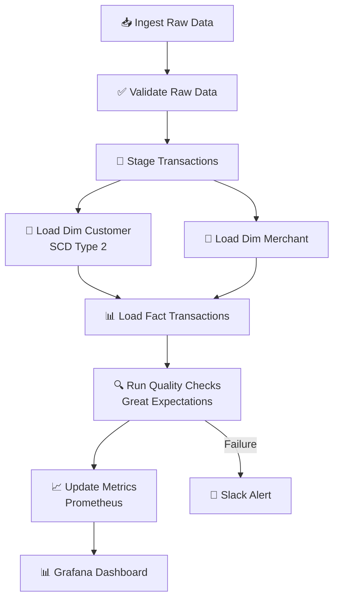
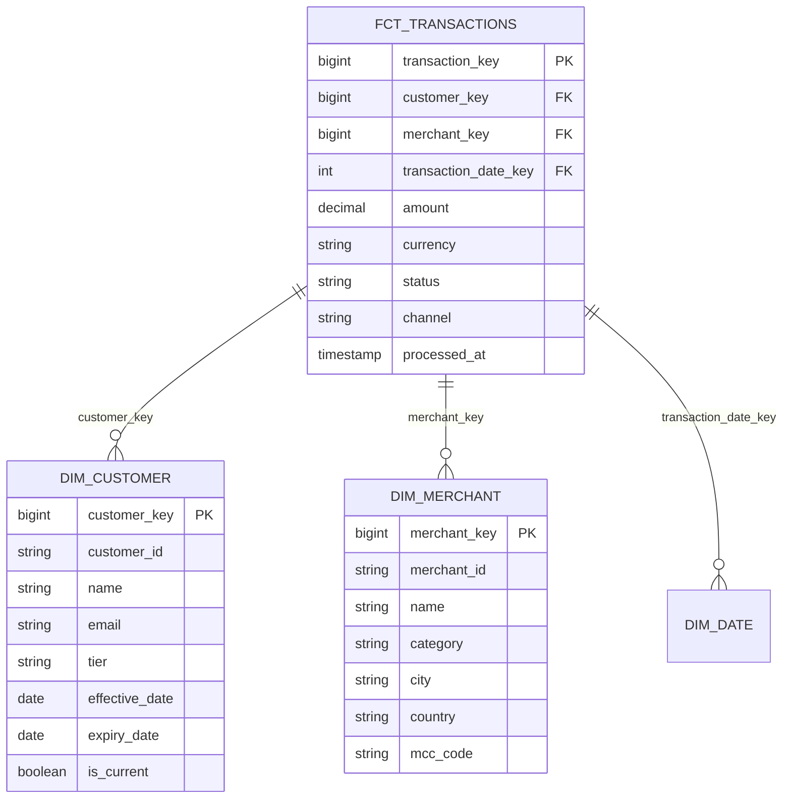

# 🏦 Real-Time Transaction Data Pipeline


A **production-ready ETL pipeline** that processes **500K+ daily financial transactions** with automated data quality validation, dimensional modeling, and real-time monitoring.

---

## 📊 Architecture Overview



## 🚀 Key Metrics

| Metric | Value |
|--------|-------|
| Daily Transaction Volume | 500K+ |
| Pipeline SLA | 99.8% success rate |
| End-to-End Latency | < 2 minutes |
| Snowflake Cost Reduction | 40% |
| Data Quality Checks | 15 validations |
| Quality Catch Rate | 99.2% |
| Query Latency Improvement | 45% |

---

## 🛠️ Tech Stack

| Component | Technology |
|-----------|-----------|
| **Orchestration** | Apache Airflow 2.5+ |
| **Data Warehouse** | Snowflake |
| **Data Quality** | Great Expectations |
| **Ingestion** | AWS Lambda + Python |
| **Monitoring** | Prometheus + Grafana |
| **Infrastructure** | Docker, Docker Compose |
| **Testing** | Pytest |
| **CI/CD** | GitHub Actions |

---

## 📁 Repository Structure

```
transaction-data-pipeline/
├── README.md                          # This file
├── requirements.txt                   # Python dependencies
├── docker-compose.yml                 # Local Airflow + monitoring setup
├── .gitignore
├── .env.example                       # Environment variable template
├── .github/
│   └── workflows/
│       ├── tests.yml                  # CI pipeline
│       └── deploy.yml                 # CD pipeline
├── dags/
│   ├── transaction_pipeline.py        # Main Airflow DAG
│   ├── common/
│   │   └── config.py                  # Configuration & constants
│   └── utils/
│       ├── data_quality.py            # Great Expectations validation
│       ├── snowflake_utils.py         # Snowflake connection helpers
│       └── slack_alerts.py            # Alerting helpers
├── sql/
│   ├── staging/
│   │   ├── stg_raw_transactions.sql   # Clean raw data
│   │   └── stg_customer_master.sql    # Customer SCD Type 2
│   ├── marts/
│   │   ├── fct_transactions.sql       # Fact table (star schema)
│   │   ├── dim_customer.sql           # Customer dimension
│   │   └── dim_merchant.sql           # Merchant dimension
│   └── monitoring/
│       ├── data_quality_metrics.sql
│       └── pipeline_sla_metrics.sql
├── tests/
│   ├── test_data_quality.py
│   ├── test_transformations.py
│   └── fixtures/
│       └── sample_transactions.csv
├── lambdas/
│   └── event_ingestion/
│       ├── lambda_function.py         # Real-time event ingestion
│       └── requirements.txt
├── monitoring/
│   ├── prometheus.yml                 # Prometheus config
│   └── grafana/
│       └── dashboards/
│           └── pipeline_health.json   # Pre-built dashboard
├── docs/
│   ├── ARCHITECTURE.md                # System design
│   ├── RUNBOOK.md                     # On-call procedures
│   └── DATA_DICTIONARY.md            # Schema docs
└── scripts/
    ├── setup_snowflake.sh             # Initial setup
    └── seed_test_data.py              # Load sample data
```

---

## ⚡ Quick Start

### Prerequisites

- **Docker Desktop** (v20.10+)
- **Python 3.9+**
- **Snowflake Account** (free trial works)

### 1. Clone & Configure

```bash
git clone https://github.com/YOUR_USERNAME/transaction-data-pipeline.git
cd transaction-data-pipeline

# Copy environment template and fill in your credentials
cp .env.example .env
# Edit .env with your Snowflake credentials, Slack webhook, etc.
```

### 2. Start Infrastructure

```bash
# Start Airflow, Prometheus, and Grafana
docker-compose up -d

# Wait for services to initialize (~60 seconds)
docker-compose logs -f airflow-webserver
```

### 3. Access Services

| Service | URL | Credentials |
|---------|-----|-------------|
| **Airflow UI** | http://localhost:8080 | `airflow` / `airflow` |
| **Grafana** | http://localhost:3000 | `admin` / `admin` |
| **Prometheus** | http://localhost:9090 | — |

### 4. Initialize Snowflake (Optional)

```bash
# Run the Snowflake setup script
chmod +x scripts/setup_snowflake.sh
./scripts/setup_snowflake.sh

# Seed test data
python scripts/seed_test_data.py --records 10000
```

### 5. Run Tests

```bash
pip install -r requirements.txt
pytest tests/ -v --tb=short
```

---

## 🔄 Pipeline Flow



### Pipeline Tasks

1. **Ingest**: Pull raw transaction data from S3/API staging area
2. **Validate**: Schema validation, null checks, type coercion
3. **Stage**: Deduplication, normalization, timestamp alignment
4. **Dimensions**: SCD Type 2 merge for customer & merchant data
5. **Facts**: Load fact table with surrogate key lookups
6. **Quality**: 15 Great Expectations checks (nulls, ranges, uniqueness, referential integrity)
7. **Monitor**: Push metrics to Prometheus, update Grafana dashboards

---

## 📐 Data Model (Star Schema)



---

## 🛡️ Data Quality Framework

| Check # | Validation | Type | Threshold |
|---------|-----------|------|-----------|
| 1 | Transaction ID not null | Completeness | 100% |
| 2 | Transaction ID unique | Uniqueness | 100% |
| 3 | Amount > 0 | Range | 99.9% |
| 4 | Amount < 1,000,000 | Range | 99.99% |
| 5 | Valid currency code | Referential | 100% |
| 6 | Valid status enum | Categorical | 100% |
| 7 | Timestamp not future | Timeliness | 100% |
| 8 | Customer ID exists | Referential | 99.5% |
| 9 | Merchant ID exists | Referential | 99.5% |
| 10 | No duplicate rows | Uniqueness | 100% |
| 11 | Schema compliance | Schema | 100% |
| 12 | Row count variance < 20% | Volume | 95% |
| 13 | Data freshness < 1 hour | Timeliness | 99% |
| 14 | Channel in valid set | Categorical | 100% |
| 15 | Card number masked | Security | 100% |

---

## 📊 Monitoring & Alerting

- **Prometheus** scrapes Airflow and custom pipeline metrics every 15s
- **Grafana** dashboard with 6 panels: success rate, duration, data quality score, SLA tracking, row counts, cost metrics
- **Slack alerts** on: task failure, SLA breach (> 2 min), data quality below threshold
- **Recovery**: Automatic retry (3 attempts, exponential backoff) before alerting

---

## 🧪 Testing

```bash
# Run all tests
pytest tests/ -v

# Run with coverage
pytest tests/ --cov=dags --cov-report=html

# Run specific test module
pytest tests/test_data_quality.py -v
```

---


